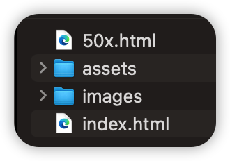

<p align="center">
    
</p>
<h4 align="center">基于VUE3+Vite+Typescript+Pinia+ElementUI的电商前台项目</h4>
<p align="center">
  
  
  
  
  
  
  
</p>


## 在线演示

- [在线演示地址](http://projectdemo.top:45678)


## 特性

- 50%接口采用mock；
- 深度依赖pinia；
- 参数及相应数据模型已标注；
- 注释完整；
- 更多信息，请参考代码注释部分。


## 安装

### ①.如果你想要本地运行

1. `git clone git@github.com:JuneQQQ/vue-shopping.git`
2. `npm install`
3. `npm run dev`


### ②.如果你想要打包发布nginx

1. `npm run build`
2. 将dist目录下所有文件扔到nginx/html中，注意以下配置

```nginx
#user  nobody;
worker_processes 1;

events {
    worker_connections 1024;
}

http {
    include mime.types;
    default_type application/octet-stream;

    #access_log  logs/access.log  main;
    sendfile on;
    #tcp_nopush     on;

    #keepalive_timeout  0;
    keepalive_timeout 65;

    server {
        listen 45678;
    
        # 网关代理
        location / {
            try_files $uri $uri/ @router;#需要指向下面的@router否则会出现vue的路由在nginx中刷新出现404
            index index.html index.htm;
        }
        #对应上面的@router，主要原因是路由的路径资源并不是一个真实的路径，所以无法找到具体的文件
        #因此需要rewrite到index.html中，然后交给路由在处理请求资源
        location @router {
            rewrite ^.*$ /index.html last;
        }
				
    		# 生产环境是一定要通过nginx转发api开头请求的，我的演示环境
        location /api {
            proxy_pass https://mock.apifox.cn/m1/1590358-0-default;
        }
        # localhost:45678/api/xxx => https://mock.apifox.cn/m1/1590358-0-default/xxx

        error_page 500 502 503 504 /50x.html;
        location = /50x.html {
            root html;
        }
    }
}
```

html文件夹下的目录结构（50x.html可没有）




### ③.如果你想要Docker运行

```sh
# MAC M1芯片拉这个  如果你linux拉这个会报错
docker run --name vue-shopping -d -p 5556:80 myteam-p-docker.pkg.coding.net/mall-project/public/vue-shopping:v1.0.0

# 其他系统拉这个
docker run --name vue-shopping -d -p 5556:80 myteam-p-docker.pkg.coding.net/mall-project/public/vue-shopping:v1.0.1
```


## 目前已知的问题

1. 商品详情页第一次进入选中有问题，这个是因为MOCK数据不具有关联性，商品详情页立即购买也有这个问题，待前后端联调修复；
2. 关于登录过期时间，由后端控制，返回前端状态码以获取状态；

